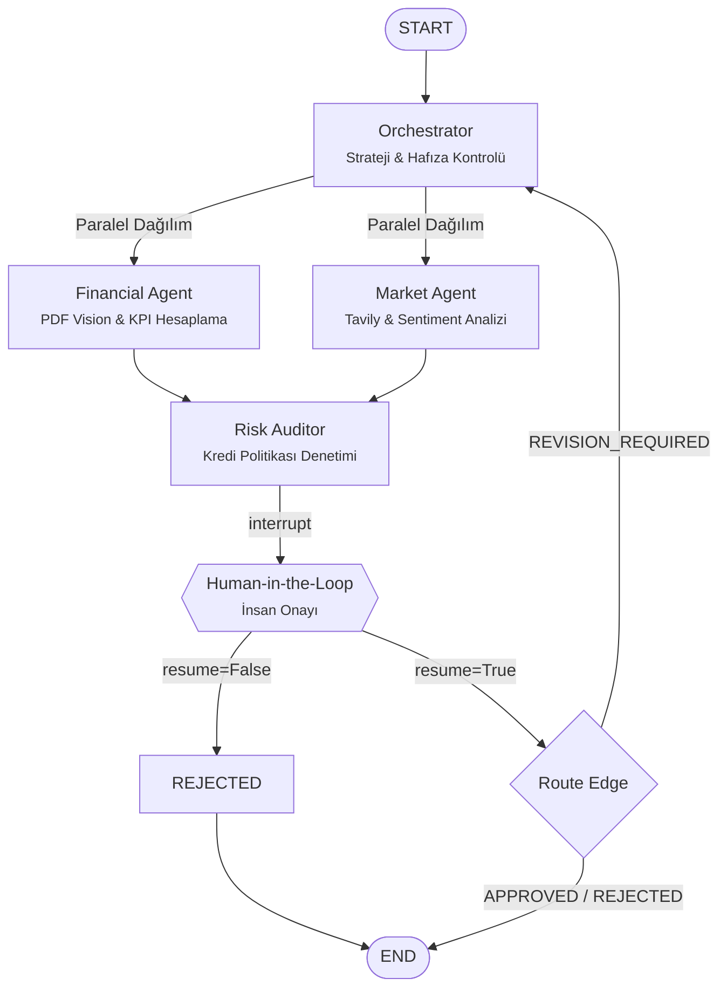
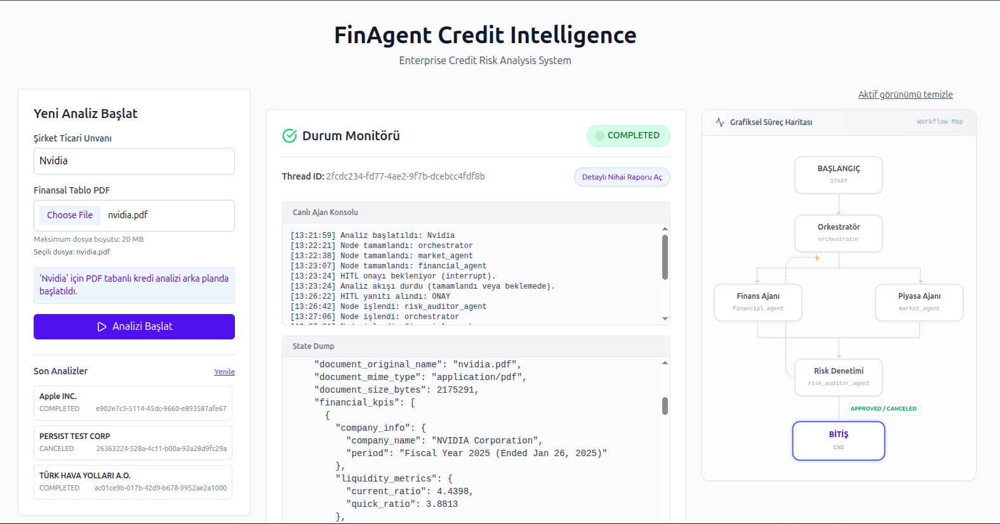
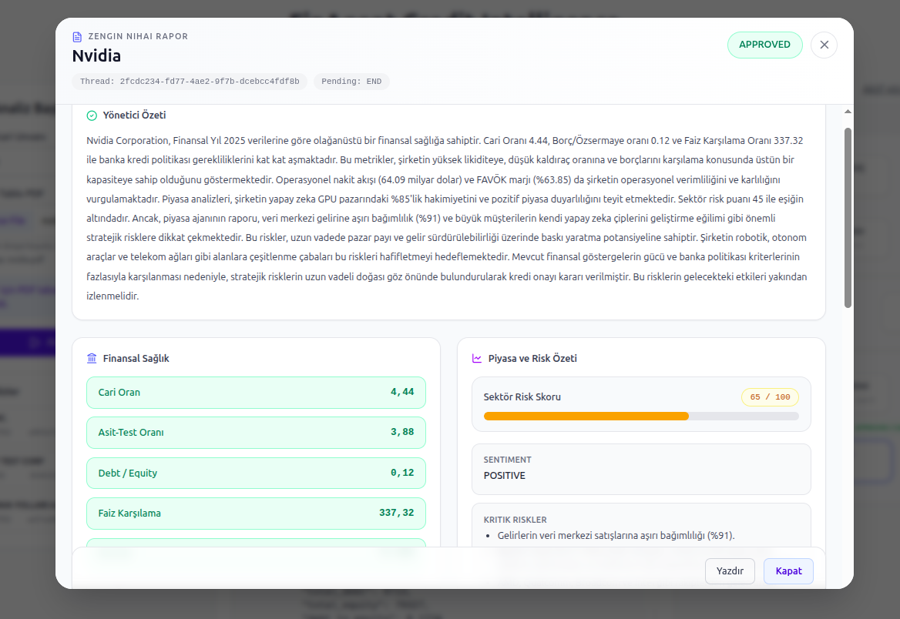

<p align="center">
  <strong>FinAgent-System</strong><br>
  <em>Multi-Agent &amp; Multi-Modal Corporate Credit Risk Analysis System</em>
</p>

<p align="center">
  
  
  
  
  
  
  
</p>

---

## İçindekiler

- [Proje Özeti](#-proje-özeti)
- [Temel Özellikler](#-temel-özellikler)
- [Teknoloji Yığını](#-teknoloji-yığını)
- [Sistem Mimarisi](#sistem-mimarisi)
- [Ekran Görüntüleri](#ekran-görüntüleri)
- [Hızlı Başlangıç](#hızlı-başlangıç)
- [API Dokümantasyonu](#api-dokümantasyonu)
- [Proje Yapısı](#-proje-yapısı)
- [Geliştirme Yol Haritası](#-geliştirme-yol-haritası)

---

## Proje Özeti

**FinAgent-System**, kurumsal bankacılıkta ticari kredi risk değerlendirme (underwriting) süreçlerini otomatize eden, **LangGraph tabanlı çoklu ajan (Multi-Agent)** ve **çoklu modal (Multi-Modal)** bir sistemdir.

### Çözülen Problemler

Geleneksel kredi değerlendirme süreçlerinde:

- Finansal tabloların (bilanço, gelir tablosu) elle incelenmesi **günler** alır.
- Piyasa haberleri ve sektörel risklerin takibi **fragmentedir** ve öznel kararlar doğurur.
- Birden fazla departman arasındaki koordinasyon **hataya açıktır**.
- Nihai karar süreci şeffaf değildir ve **denetlenebilirlik** eksiktir.

FinAgent-System, bu süreçlerin tamamını koordine eden otonom ajanlar ile çözüm sunar. PDF formatındaki finansal tabloları Gemini 2.5 Flash'ın görüntü işleme kapasitesiyle analiz eder, Tavily ile gerçek zamanlı piyasa istihbaratı toplar ve tüm süreci bir **insan denetçinin onayına** (Human-in-the-Loop) sunar.

---

## Temel Özellikler

### Multi-Agent Orchestration
Dört bağımsız ajan (**Orchestrator**, **Financial Agent**, **Market Agent**, **Risk Auditor**) LangGraph StateGraph üzerinde paralel ve sıralı akışlarla koordine olur. Sistem, döngüsel karar ağaçları (cyclic decision graph) ile revizyon mekanizması içerir.

### Financial Vision (PDF Analysis)
Gemini 2.5 Flash'ın multi-modal yetenekleri kullanılarak, yüklenen PDF formatındaki bilanço ve gelir tabloları **doğrudan görüntü olarak** işlenir. OCR'a gerek kalmadan, LLM tablolardaki kalemleri okuyor ve IFRS rasyolarını (Current Ratio, Debt/Equity, EBITDA Margin vb.) kendi başına hesaplıyor.

### Market Intelligence
**Tavily AI** entegrasyonu ile hedef şirketin sektörel riskleri, rakip analizi, haber akışı ve makroekonomik göstergeler gerçek zamanlı olarak taranır. Market Agent, bu verileri yapılandırılmış JSON formatında **risk puanı** (1-100) ve **sentiment** analizi ile raporlar.

### Human-in-the-Loop (HITL)
LangGraph `interrupt()` / `Command(resume=...)` API'si ile Risk Auditor'ın her kararı insan denetçinin onayına sunulur. Süreç PostgreSQL checkpoint'ine kaydedilir; onay gelene kadar thread frozen kalır; onay/red kararı graf akışını yeniden başlatır.

### Long-Term Memory
- **Short-Term (Checkpointer):** `PostgresSaver` ile her node geçişinde `AgentState` veritabanına yazılır. HITL sırasında uyanma noktası sağlar.
- **Long-Term (Store):** `PostgresStore` ile şirket bazlı geçmiş kararlar namespace mantığıyla saklanır. Aynı şirket/belge tekrar analiz edilmek istendiğinde, Orchestrator mevcut hafızayı algılayıp gereksiz LLM çağrısını atlar (cost saving).

### Dual API (REST + gRPC)
- **REST API:** FastAPI tabanlı, SSE streaming ile canlı izleme, HITL onay endpoint'leri.
- **gRPC:** Protobuf şeması ile kurumsal mikroservis entegrasyonu. `CreditRiskService` üzerinden `StartAnalysis` ve `GetAnalysisStatus` RPC'leri.

### React Dashboard
Canlı ajan konsolu, grafiksel süreç haritası (workflow map), HITL onay ekranı ve detaylı nihai rapor görüntüleme özelliklerine sahip etkileşimli frontend arayüzü.

---

## Teknoloji Yığını

| Katman | Teknoloji | Versiyon | İşlev |
|:---|:---|:---|:---|
| **Orkestrasyon** | LangGraph | 1.1.2 | StateGraph, döngüsel akışlar, interrupt/resume |
| **LLM** | Google Vertex AI (Gemini 2.5 Flash) | — | Multi-modal analiz, PDF Vision, yapılandırılmış çıktı |
| **Web Framework** | FastAPI | 0.135.1 | REST API, SSE streaming, background tasks |
| **gRPC** | grpcio / grpcio-tools | 1.78.0 | Mikroservis entegrasyonu, Protobuf mesajlaşma |
| **Veritabanı** | PostgreSQL | 16-alpine | Checkpoint persistence, long-term memory, activity logs |
| **Arama** | Tavily AI | 0.7.23 | Gerçek zamanlı web arama, haber ve sentiment analizi |
| **Bulut Depolama** | Google Cloud Storage | 2.18.2 | PDF doküman yüklemesi ve saklama |
| **Frontend** | React + TypeScript + Tailwind CSS | 18+ | Etkileşimli dashboard, SSE tüketimi |
| **Vektör Veritabanı** | Qdrant | latest | RAG hazırlığı (gelecek faz) |
| **Gözlemlenebilirlik** | LangSmith | — | Trace izleme, token maliyet takibi |
| **IaC** | Terraform | — | GCP kaynak yönetimi (Vertex AI API, GCS bucket) |
| **Konteynerizasyon** | Docker / Docker Compose | — | Multi-container orkestrasyon |

---

## Sistem Mimarisi



> Detaylı mimari dokümantasyon için: [`docs/ARCHITECTURE.md`](docs/ARCHITECTURE.md)

---

## Ekran Görüntüleri

### Arayüz ve Sistem Monitörü
Yazılımın canlı durumunu takibini sağlayan süreç haritası ve olay akışı.



### Nihai Karar ve Rapor
Kredi denetçisine sunulan onay ekranı ve detaylı komite raporu özeti.



---

## Hızlı Başlangıç

### Ön Koşullar

| Gereksinim | Minimum |
|:---|:---|
| Docker & Docker Compose | v24+ |
| GCP Service Account Key | Vertex AI & GCS yetkili |
| Tavily API Key | — |

### 1. Depoyu Klonlayın

```bash
git clone https://github.com/<your-org>/finagent-systems.git
cd finagent-systems
```

### 2. Ortam Değişkenlerini Yapılandırın

`.env` dosyasını projenin kök dizininde oluşturun:

```env
GOOGLE_APPLICATION_CREDENTIALS="gcp-key.json"
GOOGLE_CLOUD_PROJECT="fin-agent-360"
TAVILY_SEARCH_API="tvly-xxxxxxxxxxxxxxxxxxxxxxxxxxxxxxxxxxxxxxxx"
DATABASE_URL="postgresql://admin:admin@db:5432/langgraph_persistence"

# LangSmith Entegrasyonu (Opsiyonel)
LANGSMITH_TRACING=true
LANGSMITH_ENDPOINT="https://eu.api.smith.langchain.com"
LANGSMITH_API_KEY="lsv2_pt_xxxxxxxxxxxxxxxxxxxxxxxxxxxxx"
LANGSMITH_PROJECT="FinAgent"
```

### 3. GCP Service Account Key

`gcp-key.json` dosyasını proje kök dizinine yerleştirin. Bu dosya Vertex AI (Gemini) ve GCS erişimi için gereklidir.

### 4. Docker Compose ile Sistemi Başlatın

```bash
docker compose up --build -d
```

Bu komut şu üç servisi ayağa kaldırır:

| Servis | Port | Açıklama |
|:---|:---|:---|
| `finagent_api` | `8000` (HTTP), `50051` (gRPC) | FastAPI + gRPC sunucusu |
| `finagent_db` | `5432` | PostgreSQL 16 (persistence) |
| `finagent_qdrant` | `6333` | Qdrant vektör veritabanı |

### 5. Doğrulama

```bash
# API sağlık kontrolü
curl http://localhost:8000/

# Swagger UI
open http://localhost:8000/docs

# Yeni analiz başlatma (PDF'siz)
curl -X POST http://localhost:8000/api/v1/analysis/start \
  -H "Content-Type: application/json" \
  -d '{"company_name": "TÜRK HAVA YOLLARI A.O."}'

# PDF ile analiz başlatma
curl -X POST http://localhost:8000/api/v1/analysis/start-with-pdf \
  -F "company_name=TÜRK HAVA YOLLARI A.O." \
  -F "file=@/path/to/bilanço.pdf"
```

### 6. Frontend (Opsiyonel)

```bash
cd frontend
npm install
npm run dev
```

React dashboard varsayılan olarak `http://localhost:5173` adresinde çalışır.

---

## API Dokümantasyonu

| Belge | Açıklama |
|:---|:---|
| [`docs/ARCHITECTURE.md`](docs/ARCHITECTURE.md) | Graph topolojisi, ajan rolleri, persistence katmanı, reflection döngüsü |
| [`docs/API_GUIDE.md`](docs/API_GUIDE.md) | REST API, SSE streaming, gRPC servis referansı |
| [Swagger UI](http://localhost:8000/docs) | Otomatik oluşturulan interaktif API dokümantasyonu |

---

## Proje Yapısı

```
finagent-systems/
├── main.py                          # FastAPI + gRPC entrypoint (lifespan yönetimi)
├── docker-compose.yml               # Multi-container orkestrasyon
├── Dockerfile                       # Python 3.12 slim image, proto derleme
├── requirements.txt                 # Python bağımlılıkları
├── main.tf                          # Terraform IaC (Vertex AI API, GCS bucket)
├── langgraph.json                   # LangGraph CLI yapılandırması
├── .env                             # Ortam değişkenleri
│
├── fin_agent/                       # Ajan Çekirdeği
│   ├── agent.py                     # StateGraph tanımı, PostgreSQL bağlantısı, compile()
│   └── utils/
│       ├── state.py                 # AgentState TypedDict (tüm paylaşılan durum)
│       ├── nodes.py                 # Orchestrator, Financial, Market, Auditor node'ları
│       └── tools.py                 # Tavily arama, GCS PDF okuma araçları
│
├── app/                             # API & Servis Katmanı
│   ├── api/
│   │   ├── router.py                # Ana API router (/analysis, /history)
│   │   └── endpoints/
│   │       ├── analysis.py          # REST endpoint'leri (start, approve, status, events, cancel)
│   │       └── history.py           # Long-term memory sorgulama
│   ├── schemas/
│   │   ├── analysis.py              # Pydantic request/response modelleri
│   │   └── status.py                # ThreadStatusResponse, AgentStateSchema
│   ├── services/
│   │   ├── agent_service.py         # LangGraph stream/resume, thread yönetimi
│   │   └── document_service.py      # PDF validasyon, GCS upload/delete
│   └── grpc_server.py               # gRPC CreditRiskService implementasyonu
│
├── fin_proto/                       # gRPC Şemaları
│   ├── credit_score.proto           # Protobuf servis ve mesaj tanımları
│   ├── credit_score_pb2.py          # Derlenmiş mesaj kodu
│   └── credit_score_pb2_grpc.py     # Derlenmiş servis kodu
│
├── frontend/                        # React Dashboard
│   └── src/
│       ├── App.tsx                  # Ana uygulama, thread state yönetimi
│       └── components/
│           ├── StartForm.tsx        # Analiz başlatma formu
│           ├── StatusDashboard.tsx   # Canlı durum monitörü, workflow haritası, HITL
│           └── ReportModal.tsx      # Nihai rapor modal
│
└── tests/                           # Test dosyaları
    └── test_agent.py
```

---

## Geliştirme Yol Haritası

| Aşama | Durum | Açıklama |
|:---|:---|:---|
| Çekirdek Ajan Sistemi | Tamamlandı | 4 ajan, paralel akış, döngüsel revizyon |
| PostgreSQL Persistence | Tamamlandı | Checkpointer + Store, thread yönetimi |
| Human-in-the-Loop | Tamamlandı | interrupt() / Command(resume=...) |
| REST API + SSE | Tamamlandı | FastAPI, canlı event streaming |
| gRPC Entegrasyonu | Tamamlandı | CreditRiskService, Protobuf |
| React Dashboard | Tamamlandı | Canlı konsol, workflow haritası, HITL arayüzü |
| Gözlemlenebilirlik | Tamamlandı | LangSmith entegrasyonu, maliyet takibi |
| RAG Pipeline | Planlandı | Qdrant ile doküman araştırma |
