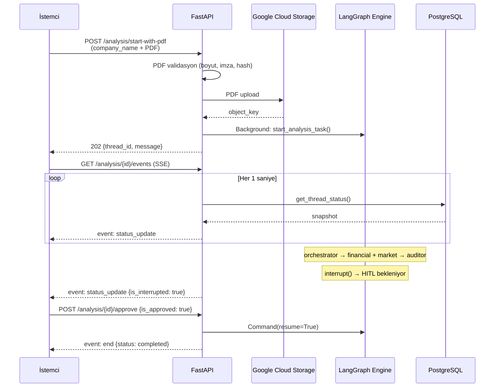
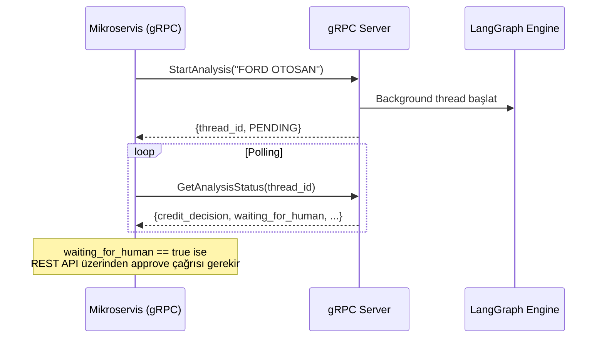

# FinAgent-System — API Entegrasyon Rehberi

> **Son Güncelleme:** 2 Nisan 2026  
> **Base URL:** `http://localhost:8000/api/v1`

---

## İçindekiler

1. [Genel Bakış](#1-genel-bakış)
2. [REST API Referansı](#2-rest-api-referansı)
   - [POST /analysis/start](#21-yeni-analiz-başlatma)
   - [POST /analysis/start-with-pdf](#22-pdf-ile-analiz-başlatma)
   - [GET /analysis/{thread_id}/status](#23-analiz-durumu-sorgulama)
   - [POST /analysis/{thread_id}/approve](#24-hitl-onay--red)
   - [POST /analysis/{thread_id}/cancel](#25-analiz-iptali)
   - [GET /analysis/recent](#26-son-analizler)
   - [GET /analysis/{thread_id}/events](#27-sse-canlı-event-stream)
   - [GET /history/{company_name}](#28-şirket-geçmişi-long-term-memory)
3. [SSE Streaming Protokolü](#3-sse-streaming-protokolü)
4. [gRPC Servis Referansı](#4-grpc-servis-referansı)
5. [Veri Modelleri](#5-veri-modelleri)
6. [Tipik Entegrasyon Senaryoları](#6-tipik-entegrasyon-senaryoları)

---

## 1. Genel Bakış

FinAgent-System, iki farklı iletişim protokolü üzerinden erişilebilir:

| Protokol | Port | Kullanım Alanı |
|:---|:---|:---|
| **REST API** (FastAPI) | `8000` | Web arayüzü, SSE streaming, HITL onay mekanizması |
| **gRPC** | `50051` | Mikroservis entegrasyonu, yüksek performanslı IPC |

Her iki protokol de aynı ajan çekirdeğini (`fin_agent/agent.py`) tetikler ve PostgreSQL üzerindeki ortak state'i paylaşır.

### Kimlik Doğrulama

Mevcut durumda API'de kimlik doğrulama yoktur. CORS politikası tüm origin'lere açıktır (`allow_origins=["*"]`). Üretime geçişte bu yapılandırmanın kısıtlanması önerilir.

---

## 2. REST API Referansı

### 2.1 Yeni Analiz Başlatma

Şirket adıyla (PDF olmadan) basit bir kredi risk analizi süreci başlatır.

```
POST /api/v1/analysis/start
```

**Request Body:**

```json
{
    "company_name": "TEST CORPORATION INC."
}
```

| Alan | Tip | Zorunlu | Açıklama |
|:---|:---|:---|:---|
| `company_name` | `string` | | Analiz edilecek şirketin tam ticari unvanı |

**Response** `202 Accepted`:

```json
{
    "thread_id": "a1b2c3d4-e5f6-7890-abcd-ef1234567890",
    "message": "'TEST CORPORATION INC.' için kredi analizi arka planda başlatıldı."
}
```

> **Not:** Eğer aynı şirket adıyla devam eden bir analiz varsa, yeni thread oluşturulmaz; mevcut `thread_id` döner.

**Davranış Detayı:**

```python
# app/api/endpoints/analysis.py — Akıllı thread yönetimi
existing_thread = agent_service.find_active_thread_for_company(request.company_name)
if existing_thread:
    return AnalysisResponse(
        thread_id=existing_thread.thread_id,
        message=f"'{request.company_name}' için devam eden bir analiz bulundu."
    )
```

---

### 2.2 PDF ile Analiz Başlatma

Finansal tablo PDF'i yükleyerek bir kredi risk analizi başlatır. PDF, Google Cloud Storage'a yüklenir ve Financial Agent tarafından Gemini Vision ile işlenir.

```
POST /api/v1/analysis/start-with-pdf
Content-Type: multipart/form-data
```

**Request (Form Data):**

| Alan | Tip | Zorunlu | Açıklama |
|:---|:---|:---|:---|
| `company_name` | `string` | | Şirket adı |
| `file` | `file` (PDF) | | Finansal tablo PDF dosyası (max 20 MB) |

**cURL Örneği:**

```bash
curl -X POST http://localhost:8000/api/v1/analysis/start-with-pdf \
  -F "company_name=TEST CORPORATION INC." \
  -F "file=@/path/to/bilanço_2024.pdf"
```

**Response** `202 Accepted`:

```json
{
    "thread_id": "b2c3d4e5-f6a7-8901-bcde-f12345678901",
    "message": "'TEST CORPORATION INC.' için PDF tabanlı kredi analizi arka planda başlatıldı."
}
```

**PDF Validasyon Kuralları:**

| Kural | Detay |
|:---|:---|
| Uzantı | Yalnızca `.pdf` |
| Boyut | Maksimum 20 MB |
| İmza Kontrolü | Dosya `%PDF` magic byte'ı ile başlamalı |
| SHA-256 | Otomatik hesaplanır; aynı hash ile aktif thread varsa yeni thread açılmaz |

**Hata Yanıtları:**

| HTTP Kodu | Durum | Detay |
|:---|:---|:---|
| `400` | Geçersiz dosya | "Yalnızca .pdf uzantılı dosya yükleyebilirsiniz." |
| `400` | Boyut aşımı | "PDF dosyası en fazla 20 MB olabilir." |
| `400` | Geçersiz imza | "Yüklenen dosya geçerli bir PDF imzası taşımıyor." |
| `500` | GCS hatası | "PDF yüklenirken sunucu hatası oluştu." |

---

### 2.3 Analiz Durumu Sorgulama

Belirtilen thread'in güncel durumunu, ajan state'ini ve interrupt bilgisini döner. UI tarafında polling mekanizması için kullanılır.

```
GET /api/v1/analysis/{thread_id}/status
```

**Response** `200 OK`:

```json
{
    "thread_id": "a1b2c3d4-e5f6-7890-abcd-ef1234567890",
    "status": "interrupted",
    "is_interrupted": true,
    "pending_node": "risk_auditor_agent",
    "activity_log": [
        "[14:32:01] Analiz başlatıldı: TEST CORPORATION INC.",
        "[14:32:05] Node tamamlandı: orchestrator",
        "[14:32:12] Node tamamlandı: financial_agent",
        "[14:32:15] Node tamamlandı: market_agent",
        "[14:32:20] HITL onayı bekleniyor (interrupt)."
    ],
    "state": {
        "company_name": "TEST CORPORATION INC.",
        "document_id": "uuid-string",
        "document_sha256": "abc123...",
        "financial_kpis": [{ "...KPI verisi..." }],
        "market_sentiment": [{ "...market analizi..." }],
        "audit_log": ["Eleştiri notu..."],
        "loop_step": 0,
        "final_report": "Kredi komitesine sunulacak yönetici özeti...",
        "credit_decision": "PENDING",
        "next_node": "risk_auditor_agent",
        "human_approval": null
    }
}
```

**Status Değerleri:**

| Status | Açıklama |
|:---|:---|
| `running` | Ajanlar aktif çalışıyor |
| `interrupted` | HITL onayı bekleniyor (risk_auditor_agent'ta duraklatıldı) |
| `completed` | Süreç başarıyla tamamlandı (APPROVED veya REJECTED) |
| `failed` | Çalışma sırasında hata oluştu |
| `canceled` | Kullanıcı tarafından iptal edildi |

---

### 2.4 HITL Onay / Red

`interrupted` durumundaki bir analizi uyandırır. İnsan denetçi onay veya red kararı verir.

```
POST /api/v1/analysis/{thread_id}/approve
```

**Request Body:**

```json
{
    "is_approved": true,
    "note": "Opsiyonel denetçi notu"
}
```

| Alan | Tip | Zorunlu | Açıklama |
|:---|:---|:---|:---|
| `is_approved` | `boolean` | | `true` = Onay, `false` = Red |
| `note` | `string` | | Denetçi açıklaması |

**Response** `202 Accepted`:

```json
{
    "message": "Kredi analizi süreci 'Onaylandı' kararıyla arka planda devam ettiriliyor."
}
```

**Karar Akışı:**

| `is_approved` | LLM Kararı | Sonuç |
|:---|:---|:---|
| `true` | `APPROVED` | Graf sonlanır → `END` |
| `true` | `REJECTED` | Graf sonlanır → `END` |
| `true` | `REVISION_REQUIRED` | Graf `orchestrator`'a döner (revizyon) |
| `false` | `*` (herhangi) | Karar `REJECTED` olarak **ezilir** → `END` |

> **Önemli:** `is_approved=false` gönderildiğinde, LLM'in orijinal kararından bağımsız olarak sonuç her zaman `REJECTED` olur. Bu, insan otoritesinin LLM üzerinde önceliğini garanti eder.

---

### 2.5 Analiz İptali

Çalışan veya interrupt durumundaki bir analizi tamamen iptal eder.

```
POST /api/v1/analysis/{thread_id}/cancel
```

**Response** `202 Accepted`:

```json
{
    "message": "Thread (a1b2c3d4-...) iptal edildi."
}
```

İptal mekanizması:
1. Thread ID, in-memory `_canceled_threads` setine eklenir
2. Aktif `stream()` döngüsü bir sonraki iterasyonda `_is_canceled()` kontrolü ile durur
3. State `CANCELED` olarak güncellenir (`agent_app.update_state()`)

---

### 2.6 Son Analizler

Son analiz thread'lerinin özet listesini döner. UI'da "hızlı devam" listesi için kullanılır.

```
GET /api/v1/analysis/recent?limit=10
```

| Parametre | Tip | Varsayılan | Açıklama |
|:---|:---|:---|:---|
| `limit` | `int` | `10` | Döndürülecek thread sayısı (max 50) |

**Response** `200 OK`:

```json
{
    "count": 3,
    "items": [
        {
            "thread_id": "uuid-1",
            "company_name": "TEST CORPORATION INC.",
            "status": "completed",
            "is_interrupted": false,
            "pending_node": null,
            "last_checkpoint_id": "checkpoint-uuid"
        },
        {
            "thread_id": "uuid-2",
            "company_name": "FORD OTOSAN",
            "status": "interrupted",
            "is_interrupted": true,
            "pending_node": "risk_auditor_agent",
            "last_checkpoint_id": "checkpoint-uuid"
        }
    ]
}
```

---

### 2.7 SSE Canlı Event Stream

Thread durumunu **Server-Sent Events** (SSE) protokolü ile gerçek zamanlı olarak izler. İstemci tarafında `EventSource` API'si ile dinlenebilir.

```
GET /api/v1/analysis/{thread_id}/events
```

**Content-Type:** `text/event-stream`

Detaylı SSE protokol açıklaması için bkz: [§3. SSE Streaming Protokolü](#3-sse-streaming-protokolü)

---

### 2.8 Şirket Geçmişi (Long-Term Memory)

LangGraph'ın `PostgresStore` içindeki şirket bazlı kalıcı hafızayı sorgular.

```
GET /api/v1/history/{company_name}?document_sha256=abc123...
```

| Parametre | Tip | Zorunlu | Açıklama |
|:---|:---|:---|:---|
| `company_name` | `path` | | Şirket adı |
| `document_sha256` | `query` | | Belirli bir PDF'in geçmişi için SHA-256 hash |

**Response — Geçmiş Mevcut:**

```json
{
    "company_name": "TEST CORPORATION INC.",
    "has_history": true,
    "memory_key": "last_credit_decision:sha256:abc123...",
    "last_decision": "APPROVED",
    "reasoning": "Likidite ve karlılık metrikleri sağlıklı, sektör riski tolere edilebilir seviyede.",
    "memory_timestamp": "2026-04-01T14:30:00.000000+00:00"
}
```

**Response — Geçmiş Yok:**

```json
{
    "company_name": "YENİ ŞİRKET A.Ş.",
    "has_history": false,
    "message": "Bu şirket için daha önce yapılmış bir analiz bulunamadı. Yeni bir başvuru oluşturabilirsiniz."
}
```

---

## 3. SSE Streaming Protokolü

SSE endpoint'i (`/analysis/{thread_id}/events`), istemciye `text/event-stream` formatında canlı güncellemeler gönderir.

### Event Türleri

| Event | Tetiklenme Zamanı | Açıklama |
|:---|:---|:---|
| `snapshot` | İlk bağlantı | Thread'in mevcut durumunun tam snapshot'ı |
| `status_update` | State değişikliği | Node tamamlanması, HITL tetiklenmesi vb. |
| `heartbeat` | ~5 saniyede bir | Bağlantı canlılık kontrolü |
| `end` | Terminal durum | `completed`, `failed` veya `canceled` |
| `error` | Hata | Sunucu taraflı hata detayı |

### Event Format

```
event: status_update
data: {"thread_id":"uuid","status":"running","is_interrupted":false,...}

event: heartbeat
data: {"thread_id":"uuid"}

event: end
data: {"thread_id":"uuid","status":"completed",...}
```

### İstemci Tarafı Kullanımı

**JavaScript (EventSource API):**

```javascript
const eventSource = new EventSource(
    `http://localhost:8000/api/v1/analysis/${threadId}/events`
);

// Her event türü için ayrı listener
eventSource.addEventListener('snapshot', (e) => {
    const data = JSON.parse(e.data);
    console.log('İlk snapshot:', data);
});

eventSource.addEventListener('status_update', (e) => {
    const data = JSON.parse(e.data);
    
    if (data.is_interrupted) {
        showHitlApprovalDialog(data);
    }
    
    updateDashboard(data);
});

eventSource.addEventListener('end', (e) => {
    const data = JSON.parse(e.data);
    console.log('Analiz tamamlandı:', data.state?.credit_decision);
    eventSource.close();
});

eventSource.addEventListener('heartbeat', () => {
    // Bağlantı canlı — UI göstergesini güncelle
});

eventSource.onerror = () => {
    console.warn('SSE bağlantısı kesildi, fallback polling başlatılıyor.');
    eventSource.close();
    startFallbackPolling(threadId);
};
```

### Sunucu Tarafı Implementasyon Detayı

```python
# app/api/endpoints/analysis.py — SSE Generator

async def event_generator():
    last_fingerprint = None
    heartbeat_tick = 0

    while True:
        status = agent_service.get_thread_status(thread_id)
        payload = status.model_dump()
        fingerprint = json.dumps(payload, sort_keys=True, ensure_ascii=False)

        if fingerprint != last_fingerprint:
            # State değişti → event gönder
            event_name = "snapshot" if last_fingerprint is None else "status_update"
            last_fingerprint = fingerprint
            yield f"event: {event_name}\ndata: {json.dumps(payload)}\n\n"
        else:
            # State değişmedi → periyodik heartbeat
            heartbeat_tick += 1
            if heartbeat_tick >= 5:
                yield f"event: heartbeat\ndata: {{\"thread_id\": \"{thread_id}\"}}\n\n"

        if payload.get("status") in ["completed", "failed", "canceled"]:
            yield f"event: end\ndata: {json.dumps(payload)}\n\n"
            break

        await asyncio.sleep(1)  # 1 saniye polling aralığı
```

**Önemli Notlar:**
- SSE stream'i **fingerprint tabanlı** çalışır: state değişmediyse `status_update` gönderilmez
- Heartbeat her ~5 saniyede gönderilerek bağlantı canlılığı korunur
- Terminal durumlarında (`completed`, `failed`, `canceled`) `end` event'i gönderilir ve stream kapanır
- HTTP header'lar: `Cache-Control: no-cache`, `X-Accel-Buffering: no` (nginx proxy desteği)

---

## 4. gRPC Servis Referansı

gRPC servisi, FastAPI ile aynı process içinde çalışır. `main.py`'daki `lifespan` yöneticisi tarafından arka plan görevi olarak başlatılır.

### 4.1 Protobuf Servis Tanımı

```protobuf
// fin_proto/credit_score.proto

syntax = "proto3";
package finagent;

// Kurumsal Kredi Risk Analiz Servisi
service CreditRiskService {
    // Yeni kredi analiz süreci başlatır
    rpc StartAnalysis (AnalysisRequest) returns (AnalysisResponse);
    
    // Var olan bir analiz sürecinin durumunu sorgular
    rpc GetAnalysisStatus (ThreadRequest) returns (AnalysisResponse);
}
```

### 4.2 Mesaj Yapıları

#### AnalysisRequest

```protobuf
message AnalysisRequest {
    string company_name = 1;  // Analiz edilecek şirketin adı
}
```

#### ThreadRequest

```protobuf
message ThreadRequest {
    string thread_id = 1;  // Sorgulanacak thread ID
}
```

#### AnalysisResponse

```protobuf
message AnalysisResponse {
    string thread_id = 1;               // Oluşturulan/sorgulanan thread kimliği
    string company_name = 2;            // Şirket adı
    string credit_decision = 3;         // PENDING | APPROVED | REJECTED | REVISION_REQUIRED | CANCELED
    string final_report = 4;            // Yönetici özeti raporu
    string financial_kpis_json = 5;     // Finansal KPI'lar (JSON string olarak serileştirilmiş)
    string market_sentiment_json = 6;   // Piyasa analizi (JSON string olarak serileştirilmiş)
    string audit_log_json = 7;          // Denetim notları (JSON array string)
    bool waiting_for_human = 8;         // HITL interrupt durumunda true
}
```

> **Not:** `financial_kpis_json`, `market_sentiment_json` ve `audit_log_json` alanları Protobuf'ta native list/map yerine **JSON string** olarak taşınır. İstemci tarafında JSON parse işlemi gerekir.

### 4.3 RPC Metodları

#### StartAnalysis

Yeni bir kredi analiz süreci tetikler.

**Akış:**
1. Şirket adı validasyonu yapılır
2. Aynı şirket için aktif thread var mı kontrol edilir (dedup)
3. Yoksa yeni `thread_id` üretilir ve arka plan thread'inde `start_analysis_task()` başlatılır
4. Hemen `AnalysisResponse` dönülür (`PENDING` durumunda)

```python
# app/grpc_server.py — StartAnalysis implementasyonu

async def StartAnalysis(self, request, context):
    company_name = request.company_name.strip()
    
    # Validasyon
    if not company_name:
        context.set_code(grpc.StatusCode.INVALID_ARGUMENT)
        context.set_details("Şirket adı (company_name) zorunludur.")
        return credit_score_pb2.AnalysisResponse()

    # Aktif thread kontrolü (dedup)
    existing_thread = find_active_thread_for_company(company_name)
    if existing_thread:
        return credit_score_pb2.AnalysisResponse(
            thread_id=existing_thread.thread_id,
            credit_decision="PENDING",
            waiting_for_human=bool(existing_thread.is_interrupted),
        )

    # Yeni thread başlat
    thread_id = str(uuid.uuid4())
    threading.Thread(
        target=start_analysis_task,
        args=(thread_id, AnalysisRequest(company_name=company_name)),
        daemon=True
    ).start()

    return credit_score_pb2.AnalysisResponse(
        thread_id=thread_id,
        company_name=company_name,
        credit_decision="PENDING",
        final_report="Analiz süreci kuyruğa alındı.",
    )
```

**Hata Kodları:**

| gRPC Status | Durum |
|:---|:---|
| `INVALID_ARGUMENT` | `company_name` boş |
| `INTERNAL` | Sunucu hatası (detay `context.details()` ile iletilir) |

---

#### GetAnalysisStatus

Mevcut bir analiz thread'inin durumunu PostgreSQL checkpoint'lerinden sorgular.

```python
# app/grpc_server.py — GetAnalysisStatus implementasyonu

async def GetAnalysisStatus(self, request, context):
    thread_id = request.thread_id
    
    if not thread_id:
        context.set_code(grpc.StatusCode.INVALID_ARGUMENT)
        return credit_score_pb2.AnalysisResponse()

    state_data = get_thread_status(thread_id)
    
    if not state_data:
        context.set_code(grpc.StatusCode.NOT_FOUND)
        context.set_details("Böyle bir thread bulunamadı.")
        return credit_score_pb2.AnalysisResponse()

    return credit_score_pb2.AnalysisResponse(
        thread_id=thread_id,
        company_name=state_obj.company_name,
        credit_decision=state_obj.credit_decision,
        final_report=state_obj.final_report,
        financial_kpis_json=json.dumps(state_obj.financial_kpis),
        market_sentiment_json=json.dumps(state_obj.market_sentiment),
        audit_log_json=json.dumps(state_obj.audit_log),
        waiting_for_human=state_data.is_interrupted
    )
```

**Hata Kodları:**

| gRPC Status | Durum |
|:---|:---|
| `INVALID_ARGUMENT` | `thread_id` boş |
| `NOT_FOUND` | Thread bulunamadı |
| `INTERNAL` | Sunucu hatası |

### 4.4 gRPC İstemci Örneği (Python)

```python
import grpc
from fin_proto import credit_score_pb2, credit_score_pb2_grpc

# Bağlantı oluştur
channel = grpc.insecure_channel("localhost:50051")
stub = credit_score_pb2_grpc.CreditRiskServiceStub(channel)

# 1. Yeni analiz başlat
start_request = credit_score_pb2.AnalysisRequest(
    company_name="TEST CORPORATION INC."
)
start_response = stub.StartAnalysis(start_request)
print(f"Thread ID: {start_response.thread_id}")
print(f"Karar: {start_response.credit_decision}")

# 2. Durumu sorgula
status_request = credit_score_pb2.ThreadRequest(
    thread_id=start_response.thread_id
)
status_response = stub.GetAnalysisStatus(status_request)
print(f"Durum: {status_response.credit_decision}")
print(f"HITL Bekleniyor: {status_response.waiting_for_human}")
print(f"Rapor: {status_response.final_report}")
```

### 4.5 Protobuf Derleme

Protobuf dosyaları Docker build sırasında otomatik derlenir. Manuel derleme için:

```bash
python -m grpc_tools.protoc \
    -I./fin_proto \
    --python_out=./fin_proto \
    --grpc_python_out=./fin_proto \
    ./fin_proto/credit_score.proto
```

Bu komut `credit_score_pb2.py` (mesaj kodu) ve `credit_score_pb2_grpc.py` (servis kodu) dosyalarını oluşturur.

---

## 5. Veri Modelleri

### 5.1 Request Modelleri

#### AnalysisRequest

```python
class AnalysisRequest(BaseModel):
    company_name: str                          # Zorunlu
    document_id: Optional[str] = None          # PDF upload sonrası atanır
    document_object_key: Optional[str] = None  # GCS object key
    document_sha256: Optional[str] = None      # PDF hash (dedup için)
    document_original_name: Optional[str] = None
    document_mime_type: Optional[str] = None
    document_size_bytes: Optional[int] = None
```

#### ApprovalRequest

```python
class ApprovalRequest(BaseModel):
    is_approved: bool      # True = Onay, False = Red
    note: Optional[str]    # Opsiyonel açıklama
```

### 5.2 Response Modelleri

#### AnalysisResponse

```python
class AnalysisResponse(BaseModel):
    thread_id: str   # UUID formatında oturum kimliği
    message: str     # Kullanıcıya gösterilecek durum mesajı
```

#### ThreadStatusResponse

```python
class ThreadStatusResponse(BaseModel):
    thread_id: str
    status: Literal["running", "interrupted", "completed", "failed", "canceled"]
    is_interrupted: bool
    pending_node: Optional[str]           # Aktif/sıradaki ajan adı
    activity_log: List[str] = []          # Canlı konsol satırları
    state: Optional[AgentStateSchema]     # Tam ajan durumu
```

#### AgentStateSchema

```python
class AgentStateSchema(BaseModel):
    company_name: str
    document_id: Optional[str] = None
    document_object_key: Optional[str] = None
    document_sha256: Optional[str] = None
    document_original_name: Optional[str] = None
    document_mime_type: Optional[str] = None
    document_size_bytes: Optional[int] = None
    financial_kpis: List[Dict[str, Any]] = []       # Finansal KPI listesi
    market_sentiment: List[Dict[str, Any]] = []     # Piyasa analizi listesi
    audit_log: List[str] = []                       # Denetim notları
    loop_step: int = 0                              # Revizyon döngü sayacı
    final_report: str = ""                          # Yönetici özeti
    credit_decision: Literal["PENDING", "APPROVED", 
                              "REJECTED", "REVISION_REQUIRED", 
                              "CANCELED"] = "PENDING"
    next_node: str = "orchestrator"
    human_approval: Optional[bool] = None
```

---

## 6. Tipik Entegrasyon Senaryoları

### Senaryo 1: PDF ile Tam Yaşam Döngüsü



### Senaryo 2: gRPC ile Polling



> **Not:** gRPC servisi şu anda HITL onay (approve/reject) RPC'si içermez. HITL kararları yalnızca REST API (`POST /analysis/{thread_id}/approve`) üzerinden verilebilir. Gelecek sürümlerde `ApproveAnalysis` RPC'si eklenebilir.

---

## Ek: HTTP Header'lar ve CORS

```python
# main.py — CORS middleware yapılandırması
app.add_middleware(
    CORSMiddleware,
    allow_origins=["*"],         # Üretime geçişte kısıtlanmalı
    allow_credentials=True,
    allow_methods=["*"],
    allow_headers=["*"],
)
```

| SSE Response Header | Değer | Açıklama |
|:---|:---|:---|
| `Cache-Control` | `no-cache` | Proxy caching'i engeller |
| `Connection` | `keep-alive` | Persistent connection |
| `X-Accel-Buffering` | `no` | Nginx reverse proxy buffering'i devre dışı bırakır |
