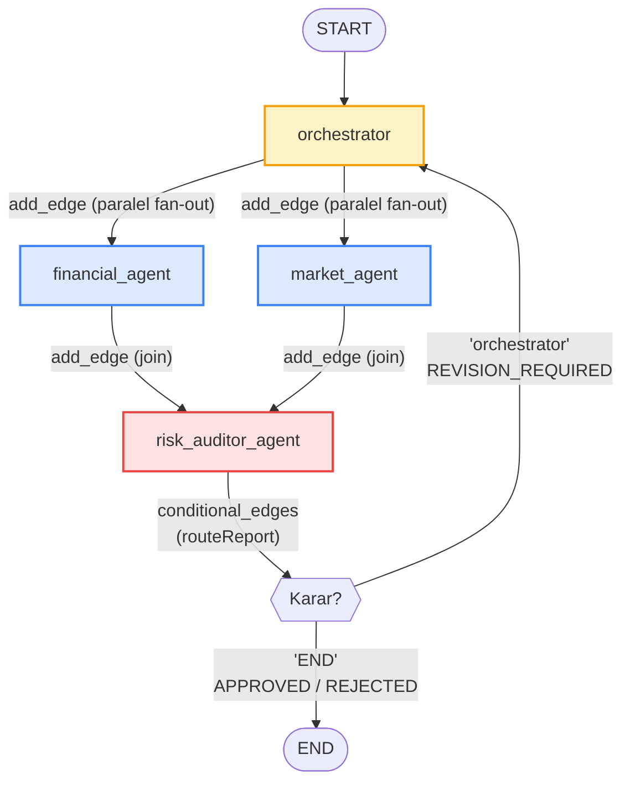
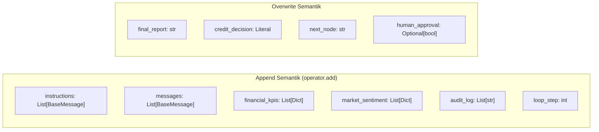
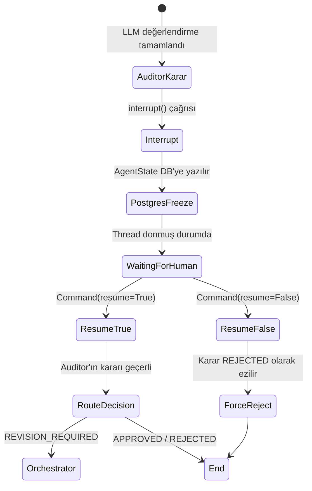
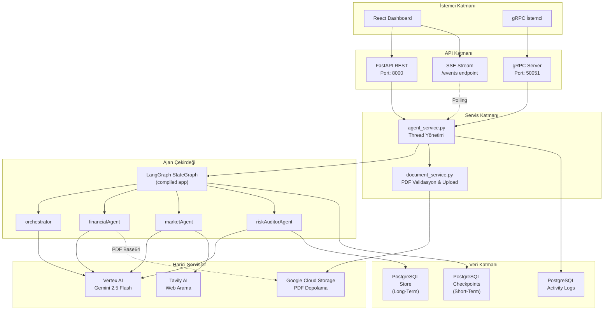

# FinAgent-System — Teknik Mimari Dokümantasyonu

> **Son Güncelleme:** 2 Nisan 2026  
> **Hedef Kitle:** Backend mühendisleri, AI mimarları, teknik denetçiler

---

## İçindekiler

1. [Genel Bakış](#1-genel-bakış)
2. [Graph Topolojisi](#2-graph-topolojisi)
3. [Agents & Roles (Ajanlar ve Roller)](#3-agents--roles-ajanlar-ve-roller)
4. [State Management (Durum Yönetimi)](#4-state-management-durum-yönetimi)
5. [Persistence Layer (Kalıcılık Katmanı)](#5-persistence-layer-kalıcılık-katmanı)
6. [Reflection Loop (Döngüsel Revizyon)](#6-reflection-loop-döngüsel-revizyon)
7. [Human-in-the-Loop (HITL)](#7-human-in-the-loop-hitl)
8. [Veri Akış Diyagramı](#8-veri-akış-diyagramı)

---

## 1. Genel Bakış

FinAgent-System, **LangGraph `StateGraph`** üzerinde inşa edilmiş döngüsel (cyclic) bir çoklu ajan sistemidir. Sistem dört bağımsız ajan düğümünden (node), bir koşullu kenardan (conditional edge) ve PostgreSQL tabanlı kalıcılık katmanından oluşur.

```
fin_agent/agent.py  →  StateGraph tanımı, PostgreSQL bağlantısı, compile()
fin_agent/utils/nodes.py  →  Ajan iş mantıkları (orchestrator, financialAgent, marketAgent, riskAuditorAgent)
fin_agent/utils/state.py  →  AgentState TypedDict (paylaşılan durum yapısı)
fin_agent/utils/tools.py  →  Harici araçlar (Tavily, GCS PDF okuma)
```

---

## 2. Graph Topolojisi

Aşağıdaki diyagram, `fin_agent/agent.py` dosyasında tanımlanan tam graf yapısını göstermektedir:



### Graf Tanımlama Kodu

```python
# fin_agent/agent.py

workflow = StateGraph(AgentState)

# Node'ları ekle
workflow.add_node("orchestrator", orchestrator)
workflow.add_node("financial_agent", financialAgent)
workflow.add_node("market_agent", marketAgent)
workflow.add_node("risk_auditor_agent", riskAuditorAgent)

# Akışı tanımla
workflow.add_edge(START, "orchestrator")
workflow.add_edge("orchestrator", "financial_agent")    # Paralel fan-out
workflow.add_edge("orchestrator", "market_agent")       # Paralel fan-out
workflow.add_edge(["financial_agent", "market_agent"], "risk_auditor_agent")  # Join

# Koşullu yönlendirme (Reflection döngüsü veya bitiş)
workflow.add_conditional_edges(
    "risk_auditor_agent",
    routeReport,
    {
        "orchestrator": "orchestrator",  # Revizyon döngüsü
        "END": END
    }
)
```

### Akış Özelikleri

| Özellik | Detay |
|:---|:---|
| **Paralel Fan-out** | `orchestrator` → `financial_agent` + `market_agent` eş zamanlı çalışır |
| **Join (Birleştirme)** | Her iki ajanın tamamlanması beklenir, ardından `risk_auditor_agent` tetiklenir |
| **Conditional Edge** | `routeReport()` fonksiyonu `state["next_node"]` değerine göre yönlendirir |
| **Döngüsel Yapı** | `REVISION_REQUIRED` kararı grafı `orchestrator`'a geri yönlendirir |

---

## 3. Agents & Roles (Ajanlar ve Roller)

### 3.1 Orchestrator (Orkestratör / Komite Başkanı)

**Dosya:** `fin_agent/utils/nodes.py` — `orchestrator()` fonksiyonu

**Sorumluluklar:**
- Kullanıcıdan gelen şirket bilgisini alır ve analiz kapsamını belirler
- **Long-Term Memory** kontrolü yaparak önceki kararları sorgular (cost saving)
- `financial_agent` ve `market_agent` için stratejik görev planı hazırlar
- Revizyon döngüsünde, Auditor'ın eleştirilerini plana dahil ederek ajanları yeniden yönlendirir

**Hafıza Kontrolü Mekanizması:**

```python
# Orchestrator, store üzerinden geçmiş kararı kontrol eder
past_memory = store.get(
    namespace=("companies", safe_company_name),
    key=_decision_memory_key(document_sha256),  # SHA-256 bazlı belge anahtarı
)

# Eğer daha önce alınmış bir karar ve ilk döngü ise analizi atla
if past_memory and loop_step == 0:
    msg = f"[SKIP_ANALYSIS] HAFIZA BULUNDU: {company} için daha önce analiz yapılmış."
    return {"instructions": [AIMessage(content=msg)]}
```

**Çıktı Formatı:** LLM'den JSON formatında alınan stratejik plan, `instructions` listesine `AIMessage` olarak eklenir. Tüm downstream ajanlar bu talimatları okur.

---

### 3.2 Financial Agent (Finansal Veri Ajanı)

**Dosya:** `fin_agent/utils/nodes.py` — `financialAgent()` fonksiyonu

**Sorumluluklar:**
- Şirketin PDF formatındaki mali tablolarını **Gemini 2.5 Flash multi-modal** API ile analiz eder
- BDDK / IFRS standartlarına uygun finansal KPI'ları hesaplar ve saf JSON olarak üretir

**Multi-Modal PDF İşleme:**

```python
# PDF'yi GCS'den base64 olarak okuyarak Gemini'ye gönderir
pdf_base64 = get_pdf_base64_from_gcs(document_object_key)

content_parts = [
    {"type": "text", "text": user_prompt},
    {"type": "file", "base64": pdf_base64, "mime_type": "application/pdf"}
]

messages = [
    SystemMessage(content=system_prompt),
    HumanMessage(content=content_parts)  # Multi-modal input
]

response = llm.invoke(messages)
```

**KPI Çıktı Şeması:**

```json
{
    "company_info": {"company_name": "string", "period": "string"},
    "liquidity_metrics": {
        "current_ratio": "float",     // Dönen Varlıklar / KVYK
        "quick_ratio": "float"        // (Dönen Varlıklar - Stoklar) / KVYK
    },
    "leverage_and_debt": {
        "total_assets": "float",
        "total_debt": "float",
        "total_equity": "float",
        "debt_to_equity": "float",          // Toplam Borç / Özkaynak
        "interest_coverage_ratio": "float"  // FAVÖK / Faiz Gideri
    },
    "profitability_metrics": {
        "revenue": "float",
        "gross_margin": "float",
        "ebitda": "float",
        "ebitda_margin": "float",
        "net_profit": "float"
    },
    "cash_flow_metrics": {
        "operating_cash_flow": "float",
        "free_cash_flow": "float"
    }
}
```

**Akıllı Revizyon Optimizasyonu:**

Revizyon turlarında gereksiz LLM çağrısı ve PDF okumasını önlemek için ajan, Auditor'ın eleştirisinin finansal verilerle ilgili olup olmadığını kontrol eder:

```python
def _needs_financial_recheck(audit_note: str) -> bool:
    keywords = ["cari oran", "likidite", "debt", "borç", "özsermaye", 
                "faiz karşılama", "ebitda", "favök", "nakit", "finansal", "kpi"]
    return any(k in audit_note for k in keywords)
```

---

### 3.3 Market Agent (Piyasa / Makro Risk Ajanı)

**Dosya:** `fin_agent/utils/nodes.py` — `marketAgent()` fonksiyonu

**Sorumluluklar:**
- Şirketin dış dünya risklerini ölçer: haber akışı, sektörel riskler, rakip analizi
- **Tavily AI** aracını (`search_market_data`) kullanarak gerçek zamanlı web araması yapar
- LLM Tool Calling mekanizmasını kullanır (`bind_tools`)

**Araç Kullanım Akışı (Tool Calling):**

```python
# 1. LLM'e araç bağla
llm_with_tools = llm.bind_tools([search_market_data])

# 2. İlk LLM çağrısı — model aracı çağırmaya karar verir
ai_msg = llm_with_tools.invoke(messages_to_send)

# 3. Araç çağrısı varsa yürüt ve sonucu geri besle
if ai_msg.tool_calls:
    for tool_call in ai_msg.tool_calls:
        search_results = search_market_data.invoke(tool_call["args"])
        tool_msg = ToolMessage(content=search_results, tool_call_id=tool_call["id"])
        messages_to_send.append(tool_msg)
    
    # 4. Araç sonucuyla nihai analizi üret
    final_response = llm.invoke(messages_to_send)
```

**Market Analiz Çıktı Şeması:**

```json
{
    "market_analysis": {
        "company_name": "string",
        "sector_risk_score": "int (1-100)",
        "sentiment": "POSITIVE | NEUTRAL | NEGATIVE",
        "key_risks": ["string"],
        "competitor_analysis": "string",
        "critical_news_summary": "string",
        "recommendation_note": "string"
    }
}
```

---

### 3.4 Risk Auditor Agent (Risk Denetçisi / Komite Üyesi)

**Dosya:** `fin_agent/utils/nodes.py` — `riskAuditorAgent()` fonksiyonu

**Sorumluluklar:**
- `financial_agent` ve `market_agent`'tan gelen paralel verileri birleştirir
- Banka Kredi Politikasına (Credit Policy) göre çapraz doğrulama yapar
- Üç olası karar verir: `APPROVED`, `REJECTED`, `REVISION_REQUIRED`
- `interrupt()` ile Human-in-the-Loop onayı talep eder
- Kararı Long-Term Memory'ye yazar

**Kredi Politikası Kuralları:**

| Kural | Eşik | Sonuç |
|:---|:---|:---|
| Cari Oran (Current Ratio) | > 1.2 | Altında: Likidite riski |
| Borç/Özsermaye (Debt to Equity) | < 4.0 | Üstünde: Yüksek kaldıraç |
| Faiz Karşılama Oranı | > 1.5 | Altında: Borç ödeme kapasitesi yetersiz |
| Sektör Risk Puanı | > 70 | Üstünde: Yüksek faaliyet riski |
| Negative Sentiment | Belirgin | Detaylı inceleme talep edilir |
| `REVISION_REQUIRED` | `loop_step == 0` iken | Sadece ilk denemede izinli |

**Halüsinasyon Koruma Mekanizması:**

```python
# LLM kurala uymayıp loop>=1 iken hala REVISION döndürürse zorla red kararı
if loop_state >= 1 and decision == "REVISION_REQUIRED":
    decision = "REJECTED"
    raw_analysis["audit_note"] = "Maximum analiz limitine ulaşıldı, zorunlu olarak reddedildi."
    raw_analysis["next_node"] = "END"
```

---

## 4. State Management (Durum Yönetimi)

Tüm ajanlar arası veri akışı, `AgentState` TypedDict yapısı üzerinden gerçekleşir. `Annotated[List[...], operator.add]` ile liste alanları append (reduction) semantiğine sahiptir:

```python
# fin_agent/utils/state.py

class AgentState(TypedDict):
    company_name: str

    # Doküman meta verileri (PDF yükleme ile gelir)
    document_id: Optional[str]
    document_object_key: Optional[str]
    document_sha256: Optional[str]
    document_original_name: Optional[str]
    document_mime_type: Optional[str]
    document_size_bytes: Optional[int]
    
    # Orkestratör talimatları (append semantik)
    instructions: Annotated[List[BaseMessage], operator.add]
    
    # Genel mesaj alanı (append semantik)
    messages: Annotated[List[BaseMessage], operator.add]
    
    # Finansal KPI'lar — her turda yeni dict append edilir
    financial_kpis: Annotated[List[Dict[str, Any]], operator.add]
    
    # Piyasa analizi — her turda yeni dict append edilir
    market_sentiment: Annotated[List[Dict[str, Any]], operator.add]
    
    # Auditor eleştirileri (reflection notu)
    audit_log: Annotated[List[str], operator.add]
    
    # Döngü sayacı — sonsuz loop koruması
    loop_step: Annotated[int, operator.add]
    
    # Nihai rapor ve karar
    final_report: str
    credit_decision: Literal["PENDING", "APPROVED", "REJECTED", 
                              "REVISION_REQUIRED", "CANCELED"]
    next_node: str
    
    # HITL onayı
    human_approval: Optional[bool]
```

### State Akış Semantiği



> **Not:** `operator.add` kullanan alanlar her node çıkışında mevcut listeye **eklenir** (append). Overwrite alanlar ise son yazan node'un değerini alır.

---

## 5. Persistence Layer (Kalıcılık Katmanı)

FinAgent-System, iki katmanlı PostgreSQL tabanlı kalıcılık sistemi kullanır:

### 5.1 Checkpoint Saver (Short-Term Memory)

```python
# fin_agent/agent.py
from langgraph.checkpoint.postgres import PostgresSaver

pool = ConnectionPool(conninfo=DB_URI, kwargs={"autocommit": True})
checkpointer = PostgresSaver(pool)
checkpointer.setup()  # İlk çalışmada tabloları oluşturur
```

| Özellik | Detay |
|:---|:---|
| **Tablo** | `checkpoints` (LangGraph tarafından otomatik oluşturulur) |
| **Granülerlik** | Her node geçişinde `AgentState` snapshot'ı yazılır |
| **Thread Bazlı** | `thread_id` ile bağımsız oturumlar yönetilir |
| **HITL Desteği** | `interrupt()` anında state dondurulur, `Command(resume=...)` ile uyandırılır |

### 5.2 Long-Term Store (Kalıcı Hafıza)

```python
# fin_agent/agent.py
from langgraph.store.postgres import PostgresStore

store = PostgresStore(pool)
store.setup()  # İlk çalışmada tabloları oluşturur
```

| Özellik | Detay |
|:---|:---|
| **Tablo** | `store` (LangGraph tarafından yönetilir) |
| **Namespace** | `("companies", "<COMPANY_NAME>")` — şirket bazlı izolasyon |
| **Key Stratejisi** | SHA-256 bazlı: `last_credit_decision:sha256:<hash>` |
| **Fallback** | Doküman hash'i yoksa: `last_credit_decision` |

**Veri Yazma (Auditor Node):**

```python
# risk_auditor_agent — karar sonrası hafızaya yazma
decision_payload = {"decision": decision, "reason": audit_note}

store.put(
    namespace=("companies", safe_company_name),
    key=_decision_memory_key(document_sha256),  # SHA bazlı anahtar
    value=decision_payload,
)
```

**Veri Okuma (Orchestrator Node):**

```python
# orchestrator — süreç başlarken hafızayı sorgulama
past_memory = store.get(
    namespace=("companies", safe_company_name),
    key=_decision_memory_key(document_sha256),
)

if past_memory and loop_step == 0:
    # Analiz atlanır → maliyet tasarrufu
    return {"instructions": [AIMessage(content="[SKIP_ANALYSIS] HAFIZA BULUNDU...")]}
```

### 5.3 Activity Logs (İşlem İzleri)

Thread bazlı işlem izleri, LangGraph tabloları dışında **özel bir PostgreSQL tablosunda** tutulur:

```sql
CREATE TABLE IF NOT EXISTS analysis_activity_logs (
    id BIGSERIAL PRIMARY KEY,
    thread_id TEXT NOT NULL,
    created_at TIMESTAMPTZ NOT NULL DEFAULT NOW(),
    line TEXT NOT NULL
);
```

Bu tablo, UI'daki "Canlı Ajan Konsolu" bileşenini besler ve her node geçişi, HITL olayı veya hata `_push_activity()` fonksiyonu ile kaydedilir.

### 5.4 Bağlantı Havuzu Yapılandırması

```python
pool = ConnectionPool(
    conninfo=DB_URI,
    kwargs={"autocommit": True}  # ActiveSqlTransaction hatasını çözer
)
```

> **Önemli:** `autocommit=True` ayarı, `PostgresSaver.setup()` sırasında `CREATE INDEX CONCURRENTLY` gibi DDL komutlarının `ActiveSqlTransaction` hatası fırlatmasını engeller.

---

## 6. Reflection Loop (Döngüsel Revizyon)

Reflection Loop, Risk Auditor'ın analizlerde eksiklik veya tutarsızlık tespit ettiğinde grafı `orchestrator`'a geri yönlendirmesiyle çalışır.

### Akış Diyagramı

```mermaid
sequenceDiagram
    participant O as Orchestrator
    participant F as Financial Agent
    participant M as Market Agent
    participant R as Risk Auditor
    participant H as Human (HITL)
    participant DB as PostgreSQL Store

    Note over O: loop_step = 0

    O->>F: Paralel görev dağılımı
    O->>M: Paralel görev dağılımı
    F->>R: financial_kpis (JSON)
    M->>R: market_sentiment (JSON)
    
    R->>R: Kredi Politikası çapraz doğrulama
    
    alt decision == "REVISION_REQUIRED" && loop_step == 0
        R->>R: loop_step += 1
        R->>O: next_node = "orchestrator"
        Note over O: Revizyon talimatı ile<br/>ajanları yeniden yönlendir
        O->>F: Güncellenmiş odak talimatı
        O->>M: Güncellenmiş odak talimatı
        F->>R: Yeniden hesaplanan KPI'lar
        M->>R: Yeniden taranan piyasa verileri
    end

    R->>R: loop_step >= 1 → Zorunlu karar
    R->>H: interrupt() — HITL onayı bekleniyor
    H->>R: Command(resume=True/False)
    R->>DB: store.put() — Kararı hafızaya yaz
    R->>END: next_node = "END"
```

### Routing Mekanizması

```python
# fin_agent/utils/nodes.py — routeReport()
def routeReport(state: AgentState):
    """
    Conditional Edge fonksiyonu.
    Graph'a "Hangi yola gideyim?" sorusunun cevabını string olarak döner.
    """
    next_node = state.get("next_node", "END")
    
    if next_node not in ["orchestrator", "END"]:
        return "END"  # Geçersiz değerlerde güvenli çıkış
        
    return next_node
```

### Sonsuz Döngü Koruması

| Mekanizma | Detay |
|:---|:---|
| **`loop_step` sayacı** | Her `REVISION_REQUIRED` kararında `+1` artar |
| **Maximum limit** | `loop_step >= 1` olduğunda `REVISION_REQUIRED` kullanılamaz |
| **Zorla Red** | LLM halüsinasyon yapıp loop>1 iken revision dönerse, koddaki guard clause otomatik olarak `REJECTED` kararı verir |
| **Anahtar Kelime Filtreleme** | `_needs_financial_recheck()` ve `_needs_market_recheck()` fonksiyonları ile yalnızca ilgili ajanlar revizyon turunda yeniden çalışır |

---

## 7. Human-in-the-Loop (HITL)

HITL mekanizması, `riskAuditorAgent` node'u içinde LangGraph'ın `interrupt()` API'si ile uygulanır.

### Yaşam Döngüsü



### Kod Akışı

```python
# riskAuditorAgent içinde:

# 1. LLM kararını al (APPROVED/REJECTED/REVISION_REQUIRED)
decision = raw_analysis.get("decision", "REJECTED")

# 2. Halüsinasyon koruması
if loop_state >= 1 and decision == "REVISION_REQUIRED":
    decision = "REJECTED"

# 3. interrupt() — Graf burada durur, state PostgreSQL'e yazılır
human_decision = interrupt({
    "question": "Denetçi kararını onaylıyor musunuz?",
    "auditor_decision": decision,
    "audit_note": raw_analysis.get("audit_note", ""),
    "summary_report": raw_analysis.get("summary_report", "")
})

# 4. İnsan kararı
if not human_decision:
    decision = "REJECTED"  # İnsan reddettiyse → zorla red
```

### Resume Mekanizması (API Tarafı)

```python
# app/services/agent_service.py — resume_analysis_task()

resume_command = Command(resume=approval_data.is_approved)

for step in agent_app.stream(resume_command, config=config):
    for node_name, updates in step.items():
        logger.info(f"[{thread_id}] >>> Ajan Devam Ediyor: {node_name}")
```

---

## 8. Veri Akış Diyagramı

Aşağıdaki diyagram, bir kredi analizi sürecinde verilerin hangi katmandan geçtiğini ve nereye yazıldığını gösterir:



---

## Ek: Önemli Tasarım Kararları

| Karar | Gerekçe |
|:---|:---|
| **Paralel fan-out** (Orchestrator → Financial + Market) | Bağımsız veri kaynaklarını eş zamanlı işleyerek toplam süreyi kısaltır |
| **SHA-256 bazlı Memory Key** | Aynı şirketin farklı PDF'leri ile yeni analiz yapılabilmesini, aynı PDF ile tekrar analiz istenmesi durumunda ise maliyet tasarrufunu sağlar |
| **`autocommit=True`** | `PostgresSaver.setup()` sırasında `CREATE INDEX CONCURRENTLY` hatalarını çözer |
| **`loop_step` guard clause** | LLM halüsinasyonuna karşı kod düzeyinde sonsuz döngü koruması |
| **Anahtar kelime tabanlı recheck** | Revizyon turlarında yalnızca eleştirilen alana sahip ajanın yeniden çalışması; diğer ajanın mevcut verisini kullanması |
| **`interrupt()` + `Command(resume=)`** | LangGraph native HITL desteği; state otomatik olarak check-point'e yazılır |
